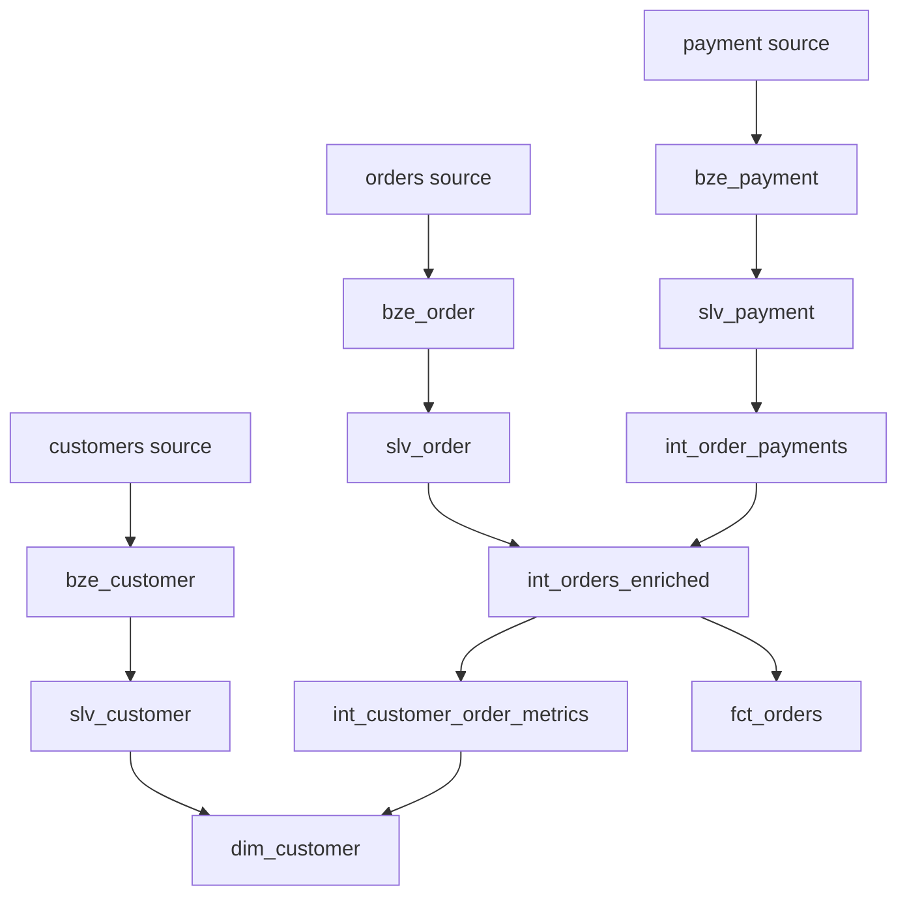

# dbt BigQuery Portfolio

A data transformation and dimensional modeling project built with **dbt Core** and **Google BigQuery**.

The project transforms raw Jaffle Shop and Stripe data through a layered architecture:

**Source → Bronze → Silver → Gold**

The goal is to demonstrate practical analytics engineering concepts including data modeling, testing, reusable macros, grain management, joins, aggregations, dimensional modeling, BigQuery optimization, and incremental processing.

---

## Tech Stack

| Technology | Usage |
|---|---|
| **dbt Core** | Data transformation, modeling and testing |
| **BigQuery** | Cloud data warehouse |
| **SQL** | Data transformation and modeling |
| **Jinja** | Reusable transformation logic |
| **Git / GitHub** | Version control |
| **VS Code** | Development environment |
| **Python** | Local dbt environment |

---

## Architecture

The core project follows a layered data architecture:

```text
Sources
   ↓
Bronze
   ↓
Silver - Standardized
   ↓
Silver - Intermediate
   ↓
Gold
```

An additional isolated practice layer is used to experiment with more advanced dbt and BigQuery concepts without modifying the production-style core models.

```text
Core Architecture
01_bronze
    ↓
02_silver
    ↓
03_gold

Advanced Practice
04_practice
```

---

## Bronze

The Bronze layer creates physical copies of the raw source data with minimal transformation.

| Model | Source |
|---|---|
| `bze_customer` | `dbt-tutorial.jaffle_shop.customers` |
| `bze_order` | `dbt-tutorial.jaffle_shop.orders` |
| `bze_payment` | `dbt-tutorial.stripe.payment` |

Source-level data quality tests are applied before downstream transformations.

---

## Silver - Standardized

The standardized Silver layer cleans and standardizes raw data while maintaining its original business grain.

Models:

- `slv_customer`
- `slv_order`
- `slv_payment`

Transformations include:

- Column renaming
- Text standardization
- Status normalization
- Customer name cleaning
- Payment conversion from cents to dollars

---

## Silver - Intermediate

The Intermediate layer handles joins, aggregations, and grain changes required before building business-facing models.

### `int_order_payments`

Aggregates payment attempts from:

**1 row per payment → 1 row per order**

Calculates:

- Total successful payment amount
- Payment attempts
- Successful payments
- Failed payments

The resulting `order_id` grain is validated using `unique` and `not_null` tests.

### `int_orders_enriched`

Combines standardized orders with aggregated payment information.

**Grain: 1 row per order**

This model preserves every order through a `LEFT JOIN` with the aggregated payment model.

### `int_customer_order_metrics`

Aggregates order-level information from:

**1 row per order → 1 row per customer**

Calculates:

- Total orders
- First order date
- Last order date
- Total spend
- Successful payment count
- Failed payment count

The resulting `customer_id` grain is explicitly tested for uniqueness.

---

## Gold Layer

The Gold layer contains business-ready dimensional models designed for analytics and reporting.

### `fct_orders`

Fact table containing order and payment information.

**Grain: 1 row per order**

Main fields include:

- `order_id`
- `customer_id`
- `order_date`
- `order_status`
- `total_amount`
- `payment_count`
- `successful_payment_count`
- `failed_payment_count`
- `etl_loaded_at`

### `dim_customer`

Customer dimension enriched with aggregated order metrics.

**Grain: 1 row per customer**

The model combines:

```text
slv_customer
      +
int_customer_order_metrics
      ↓
dim_customer
```

Customers without orders are preserved through a `LEFT JOIN`.

For these customers:

- `total_orders = 0`
- `total_spent = 0`
- Successful payment count = `0`
- Failed payment count = `0`
- First and last order dates remain `NULL`

---

## Data Lineage



---

## Data Quality

The project uses dbt tests throughout the pipeline.

### Generic tests

- `unique`
- `not_null`
- `accepted_values`
- `relationships`

### Custom singular tests

Custom SQL tests are also used for business-specific data quality rules.

Examples include:

- Customer last name validation
- Standardized customer last name format
- Non-negative payment amount validation

### Grain validation

Models that change or preserve important grains are explicitly tested for uniqueness.

| Model | Expected Grain | Grain Key |
|---|---|---|
| `int_order_payments` | 1 row per order | `order_id` |
| `int_orders_enriched` | 1 row per order | `order_id` |
| `int_customer_order_metrics` | 1 row per customer | `customer_id` |
| `fct_orders` | 1 row per order | `order_id` |
| `dim_customer` | 1 row per customer | `customer_id` |

The complete core project can be validated end-to-end using:

```bash
dbt build --exclude tag:practice
```

---

## Custom Macros

### `cents_to_dollars`

Reusable Jinja macro used to convert payment amounts from cents to dollars.

Example purpose:

```text
100 cents → 1.00 dollars
3000 cents → 30.00 dollars
```

### `generate_schema_name`

Overrides dbt's default schema concatenation behavior.

Instead of generating schemas such as:

```text
analytics_dev_dbt_bronze
```

models are created directly inside:

- `dbt_bronze`
- `dbt_silver`
- `dbt_gold`
- `dbt_practice`

---

## Advanced Practice

An isolated `04_practice` layer is included to explore more advanced dbt and BigQuery functionality without modifying the core Bronze, Silver, and Gold architecture.

All practice models are tagged with:

```text
practice
```

and are materialized inside:

```text
dbt_practice
```

---

### Partitioning

Model:

```text
fct_orders_partitioned
```

The model creates a copy of `fct_orders` partitioned by:

```text
order_date
```

dbt configuration:

```sql
{{
    config(
        materialized='table',
        partition_by={
            'field': 'order_date',
            'data_type': 'date',
            'granularity': 'day'
        }
    )
}}
```

Partitioning allows BigQuery to avoid scanning unnecessary partitions when queries filter by date.

Example:

```sql
select *
from fct_orders_partitioned
where order_date >= date '2018-03-01';
```

### BigQuery Sandbox limitation

This project currently uses the BigQuery Sandbox.

The Sandbox applies a **60-day partition expiration**.

Because the Jaffle Shop dataset contains order dates from 2018, partitions created using those historical dates expire immediately in the current environment.

The model therefore demonstrates the correct dbt partitioning configuration, although the historical partitions cannot be retained in this Sandbox setup.

---

### Clustering

Model:

```text
fct_orders_clustered
```

The model creates a clustered copy of `fct_orders` using:

```text
order_status
```

dbt configuration:

```sql
{{
    config(
        materialized='table',
        cluster_by=['order_status']
    )
}}
```

Clustering physically organizes BigQuery storage blocks around similar values.

Queries that frequently filter using:

```sql
where order_status = 'completed'
```

can benefit from reduced block scanning on sufficiently large datasets.

---

### Incremental Model

Model:

```text
fct_orders_incremental
```

The incremental model uses:

- `materialized='incremental'`
- `unique_key='order_id'`
- `incremental_strategy='merge'`
- `is_incremental()`
- `etl_loaded_at` as the incremental watermark

The intended behavior is:

```text
First execution
    ↓
Load all records

Subsequent executions
    ↓
Find latest etl_loaded_at already loaded
    ↓
Process only newer records
    ↓
MERGE into destination table
```

The incremental filter is applied only when dbt detects an existing incremental table.

Conceptually:

```sql
where etl_loaded_at > (
    select max(etl_loaded_at)
    from existing_incremental_table
)
```

### BigQuery Sandbox limitation

The first incremental table creation can be performed normally.

Subsequent executions using the `merge` incremental strategy require a BigQuery DML `MERGE` operation.

The current Sandbox environment does not allow this operation without billing enabled.

The model is therefore retained as an implementation and learning exercise demonstrating the dbt incremental pattern.

---

## Project Structure

```text
dbt-bigquery-portfolio/
│
├── models/
│   │
│   ├── 01_bronze/
│   │   ├── _sources.yml
│   │   ├── bze_customer.sql
│   │   ├── bze_order.sql
│   │   └── bze_payment.sql
│   │
│   ├── 02_silver/
│   │   │
│   │   ├── 01_standardized/
│   │   │   ├── _silver_models.yml
│   │   │   ├── slv_customer.sql
│   │   │   ├── slv_order.sql
│   │   │   └── slv_payment.sql
│   │   │
│   │   └── 02_intermediate/
│   │       ├── _intermediate_models.yml
│   │       ├── int_customer_order_metrics.sql
│   │       ├── int_order_payments.sql
│   │       └── int_orders_enriched.sql
│   │
│   ├── 03_gold/
│   │   ├── _gold_models.yml
│   │   ├── dim_customer.sql
│   │   └── fct_orders.sql
│   │
│   └── 04_practice/
│       │
│       ├── 01_partitioning/
│       │   └── fct_orders_partitioned.sql
│       │
│       ├── 02_clustering/
│       │   └── fct_orders_clustered.sql
│       │
│       └── 03_incremental/
│           └── fct_orders_incremental.sql
│
├── macros/
│   ├── cents_to_dollars.sql
│   └── generate_schema_name.sql
│
├── tests/
│   ├── test_bze_customer_last_name_valid.sql
│   ├── test_slv_customer_last_name_format.sql
│   └── test_source_payment_amount_non_negative.sql
│
├── .github/
│   └── workflows/
│       └── dbt_job.yml
│
├── .gitignore
├── dbt_project.yml
├── README.md
└── requirements.txt
```

The GitHub Actions workflow directory is included as a foundation for future CI/CD practice.

---

## Running the Project

### Install dependencies

```bash
pip install -r requirements.txt
```

### Check the dbt connection

```bash
dbt debug
```

---

### Build the core project

The production-style Bronze, Silver, and Gold architecture can be built and tested with:

```bash
dbt build --exclude tag:practice
```

The practice layer is intentionally excluded because some experimental models are affected by BigQuery Sandbox limitations.

---

### Run core models only

```bash
dbt run --exclude tag:practice
```

---

### Run core tests

```bash
dbt test --exclude tag:practice
```

---

### Run practice models

All practice models can be selected using their shared tag:

```bash
dbt run --select tag:practice
```

They can also be executed individually.

Partitioning:

```bash
dbt run -s fct_orders_partitioned
```

Clustering:

```bash
dbt run -s fct_orders_clustered
```

Incremental:

```bash
dbt run -s fct_orders_incremental
```

---

## Environment

The project was developed using:

- **dbt Core:** 1.12.5
- **dbt-bigquery:** 1.12.1
- **Google BigQuery**
- **Python**
- **VS Code**
- **Git / GitHub**

Authentication credentials and local dbt profile configuration are intentionally excluded from version control.

The local environment uses a `profiles.yml` file that is ignored by Git.

Credential management using environment variables and a secret management solution is planned as a future improvement.

---

## Key Concepts Demonstrated

### dbt

- dbt project configuration
- Sources
- `source()`
- `ref()`
- Dependency management
- Jinja
- Custom macros
- Generic tests
- Singular tests
- Model selection
- Tags
- Incremental models
- `is_incremental()`
- Incremental watermarks
- `MERGE` strategy

### Data Modeling

- Layered data architecture
- Bronze / Silver / Gold modeling
- Grain management
- Grain changes
- Aggregations
- Safe joins
- Fact tables
- Dimension tables
- Dimensional modeling
- Business-ready datasets

### BigQuery

- Dataset organization
- Table materialization
- Date partitioning
- Partition pruning
- Clustering
- Incremental processing concepts
- BigQuery Sandbox limitations

### Engineering Workflow

- Git-based development
- GitHub version control
- Reproducible Python dependencies
- Project documentation
- Isolated experimental models
- End-to-end dbt builds
- Data lineage visualization