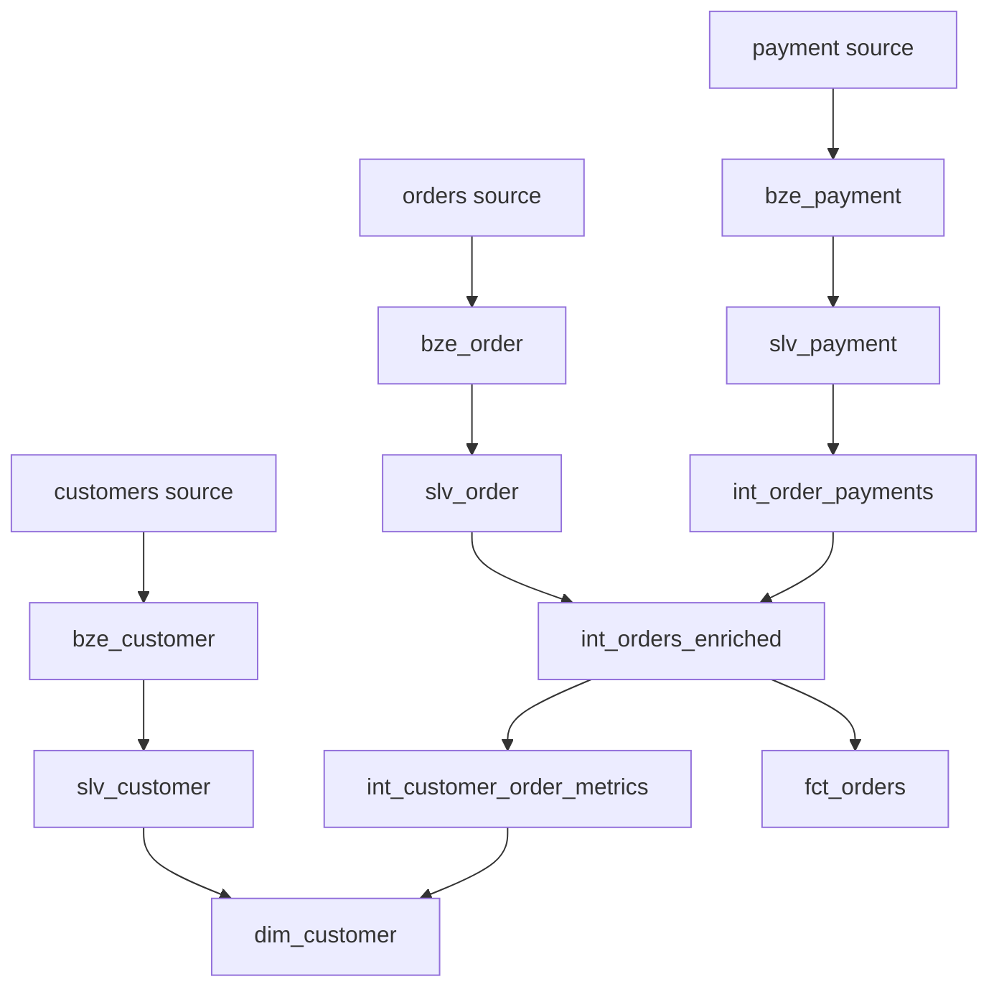

# dbt BigQuery Portfolio

A data transformation and dimensional modeling project built with **dbt Core** and **Google BigQuery**.

The project transforms raw Jaffle Shop and Stripe data through a layered architecture:

**Source → Bronze → Silver → Gold**

The goal is to demonstrate practical analytics engineering concepts including data modeling, testing, reusable macros, grain management, joins, aggregations, and dimensional modeling.

---

## Tech Stack

| Technology | Usage |
|---|---|
| **dbt Core** | Data transformation and testing |
| **BigQuery** | Cloud data warehouse |
| **SQL** | Data modeling |
| **Jinja** | Reusable transformation logic |
| **Git / GitHub** | Version control |
| **VS Code** | Development environment |

---

## Architecture

The project follows a layered data architecture:

```text
Sources
   ↓
Bronze
   ↓
Silver - Standardized
   ↓
Silver - Intermediate
   ↓
Gold
```

### Bronze

Creates physical copies of the raw source data with minimal transformation.

| Model | Source |
|---|---|
| `bze_customer` | `dbt-tutorial.jaffle_shop.customers` |
| `bze_order` | `dbt-tutorial.jaffle_shop.orders` |
| `bze_payment` | `dbt-tutorial.stripe.payment` |

---

### Silver - Standardized

Cleans and standardizes raw data while maintaining its original business grain.

Models:

- `slv_customer`
- `slv_order`
- `slv_payment`

Transformations include:

- Column renaming
- Text standardization
- Status normalization
- Customer name cleaning
- Payment conversion from cents to dollars

---

### Silver - Intermediate

Handles joins, aggregations, and grain changes required before building business-facing models.

#### `int_order_payments`

Changes the grain from:

**1 row per payment → 1 row per order**

Calculates:

- Total successful payment amount
- Payment attempts
- Successful payments
- Failed payments

#### `int_orders_enriched`

Combines standardized orders with aggregated payment information.

**Grain: 1 row per order**

#### `int_customer_order_metrics`

Changes the grain from:

**1 row per order → 1 row per customer**

Calculates:

- Total orders
- First order date
- Last order date
- Total spend
- Successful payment count
- Failed payment count

---

## Gold Layer

Business-ready dimensional models used for analytics and reporting.

### `fct_orders`

Fact table containing order and payment information.

**Grain: 1 row per order**

Main fields include:

- `order_id`
- `customer_id`
- `order_date`
- `order_status`
- `total_amount`
- `payment_count`
- `successful_payment_count`
- `failed_payment_count`

### `dim_customer`

Customer dimension enriched with aggregated order metrics.

**Grain: 1 row per customer**

Customers without orders are preserved through a `LEFT JOIN`.

For these customers:

- `total_orders = 0`
- `total_spent = 0`
- Payment counts = `0`
- First and last order dates remain `NULL`

---

## Data Lineage



---

## Data Quality

The project uses dbt tests throughout the pipeline.

### Generic tests

- `unique`
- `not_null`
- `accepted_values`
- `relationships`

### Custom singular tests

Custom SQL tests are also used for business-specific data quality rules.

### Grain validation

Models that change or preserve important grains are explicitly tested for uniqueness:

| Model | Grain key |
|---|---|
| `int_order_payments` | `order_id` |
| `int_orders_enriched` | `order_id` |
| `int_customer_order_metrics` | `customer_id` |
| `fct_orders` | `order_id` |
| `dim_customer` | `customer_id` |

---

## Custom Macros

### `cents_to_dollars`

Reusable Jinja macro used to convert payment amounts from cents to dollars.

### `generate_schema_name`

Overrides dbt's default schema concatenation behavior.

Models are created directly inside:

- `dbt_bronze`
- `dbt_silver`
- `dbt_gold`

---

## Project Structure

```text
models/
├── 01_bronze/
│   ├── _sources.yml
│   ├── bze_customer.sql
│   ├── bze_order.sql
│   └── bze_payment.sql
│
├── 02_silver/
│   ├── 01_standardized/
│   │   ├── _silver_models.yml
│   │   ├── slv_customer.sql
│   │   ├── slv_order.sql
│   │   └── slv_payment.sql
│   │
│   └── 02_intermediate/
│       ├── _intermediate_models.yml
│       ├── int_customer_order_metrics.sql
│       ├── int_order_payments.sql
│       └── int_orders_enriched.sql
│
└── 03_gold/
    ├── _gold_models.yml
    ├── dim_customer.sql
    └── fct_orders.sql

macros/
├── cents_to_dollars.sql
└── generate_schema_name.sql

tests/
```

---

## Running the Project

### Install dependencies

```bash
pip install -r requirements.txt
```

### Check the dbt connection

```bash
dbt debug
```

### Build the complete project

```bash
dbt build
```

### Run models

```bash
dbt run
```

### Run tests

```bash
dbt test
```

---

## Environment

The project was developed using:

- **dbt Core:** 1.12.5
- **dbt-bigquery:** 1.12.1
- **Google BigQuery**
- **Python**
- **VS Code**

Authentication credentials and local dbt profile configuration are intentionally excluded from version control.

---

## Key Concepts Demonstrated

- Layered data architecture
- dbt sources and references
- Data quality testing
- SQL transformations
- Jinja macros
- Grain management
- Aggregations
- Safe joins
- Dimensional modeling
- Fact and dimension tables
- Git-based development workflow